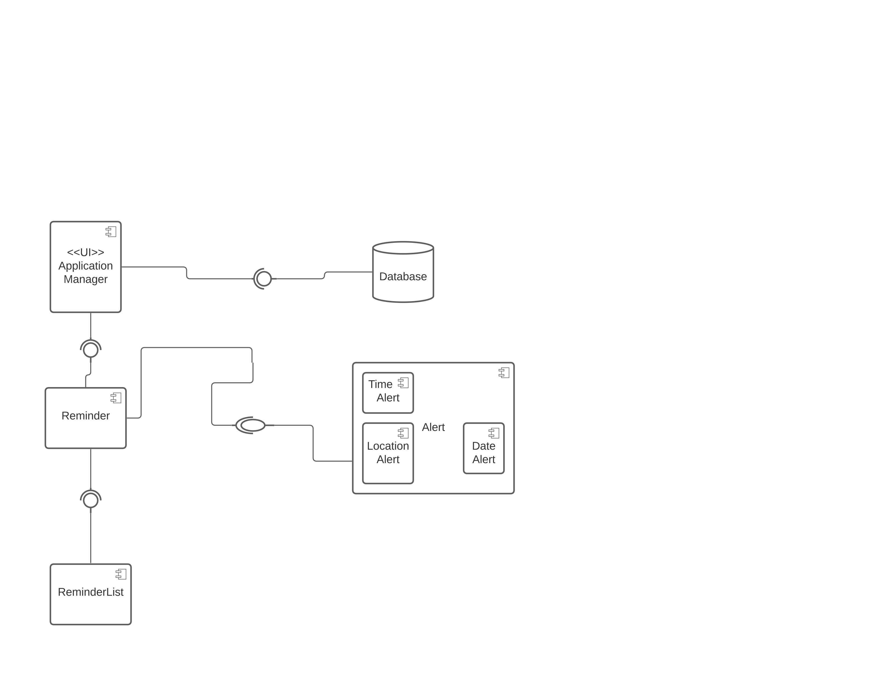
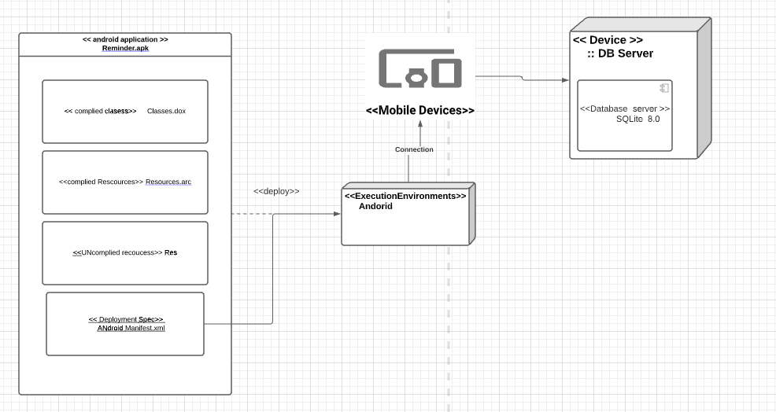
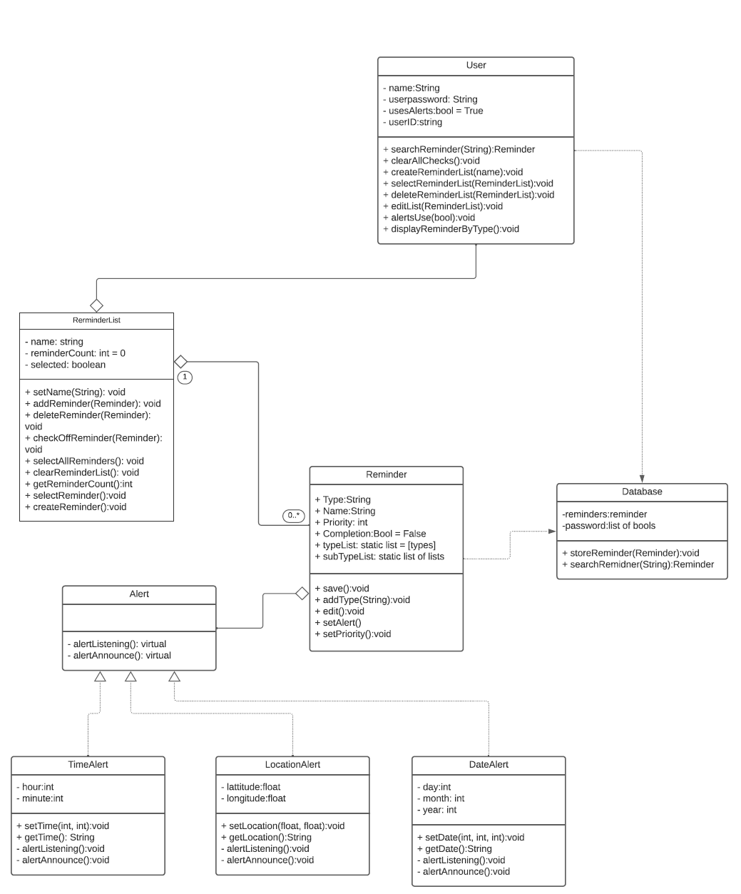
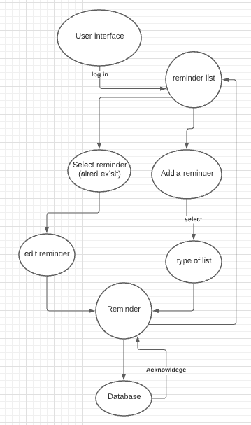
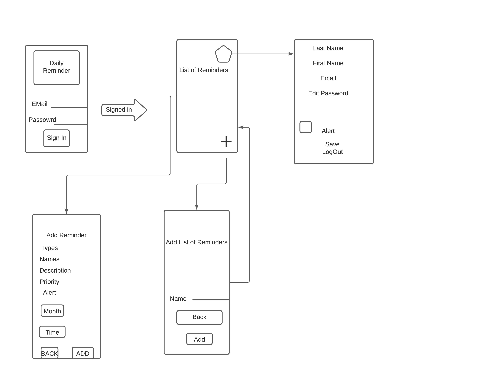

# Design Document

 

**Author**: \<Chenxian Xia, Michael Grossman, Kenneth Hasiholan\>

 

## 1 Design Considerations

### 1.1 Assumptions

 

*This software is assumed to be running on an android device of API level 21 or higher. The user is assumed to be computer literate and comfortable interacting with android apps. The user is assumed to be using the software themselves. This software will be used to provide reminders to the user.*

 

### 1.2 Constraints

*The UI must be intuitive and responsive. There must be weekly submittals for the project via team meetings. We must write the program in Java using android studio. We must use the SQLite for database implementation.*

 

### 1.3 System Environment

 *Android Studio development environment ( IDE ) for android application development will be suited for reminder application design. The minimum target for the android application will be above API level 21.*

 

## 2 Architectural Design

  

### 2.1 Component Diagram

  

*The User Interface (UI) interacts with the local copy of the reminder lists, and the database directly for searching. The reminder list communicates with the database directly saving reminders as they are created, edited, and deleted. Reminders may contain different types of alerts*

 

### 2.2 Deployment Diagram

 

*The reminder app will run on android devices, communicating with a database server.*

 

## 3 Low-Level Design

 

*The UI component will largely work with the User class, handling the high level organizational work. The UI component will interact with the database to search for reminders. Reminder lists will be created from the UI component/User class, and will trigger the reminders to save to the database when they are created, edited, and deleted. The reminder component will have an amount of 0 or 1 alerts which may be triggered in a variety of ways, such as location, date, and time of day. Reminders will be stored locally, one loaded, into a reminder list data structure.*

 

### 3.1 Class Diagram

​	
### 3.2 Other Diagrams
 
    

 

## 4 User Interface Design

