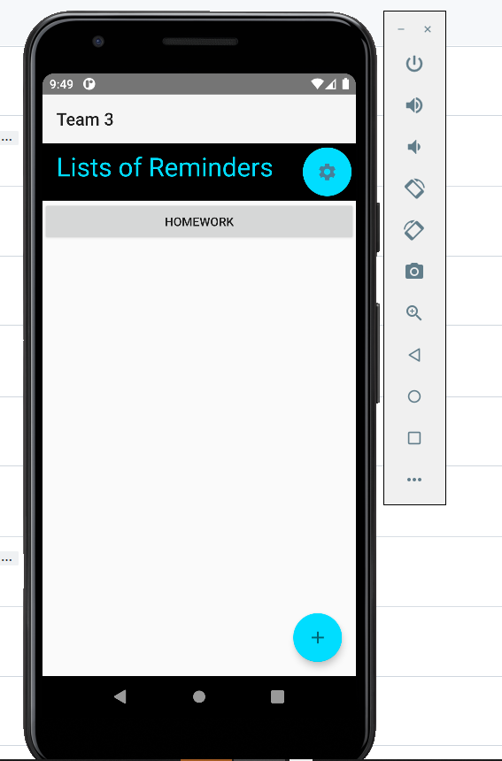

This is an application for a user to set a reminder. 
For using this app user must register by using email and password. It step is only required for the First time user.

After signing to this app, this page will lead to the List of Reminder page.

Here user can add reminder, and edit the profile configurations.

In this page, user can change their last name, first name, email and password. Also they can activate or deactivate alert system. Finally they have options to save their informations or they can cancel it by using logout button.

In this page user can add name of the reminder using add button or cancel this process by using back button.

 This page will pop up after clicking specific reminder from the List of Reminder. Here use can use four types of reminder such as, Doctor, School, Appointment and Exams. User can select the type of reminder and also can add name, descriptions and set priority of the reminder. Beside that, user also has access to set date and time for the reminder. After finishing everything user can save the data by clicking on the ADD button. After setting everything user will be notified from the app. To clarify user will not able to enter same name twice for the reminder.

